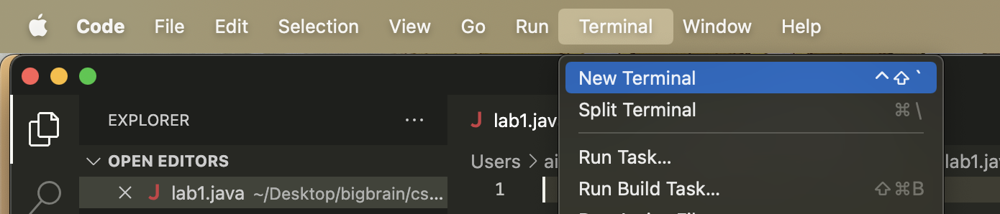
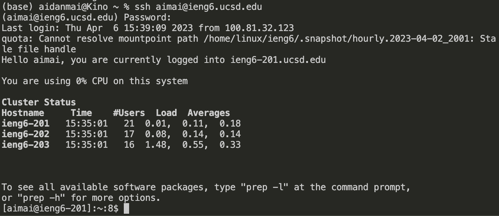
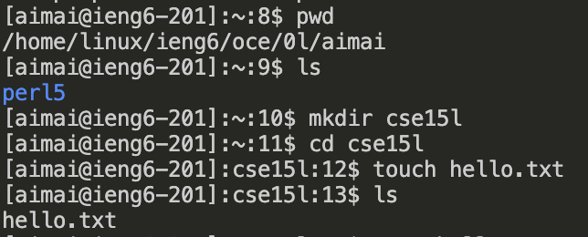

# Lab 1 Lab Report

## Remote Connection Tutorial

---

## 1) Installing VScode

I did not do the installation step as I already had VScode installed.

However, [Link](https://code.visualstudio.com/docs/setup/setup-overview)[this setup guide] from VScode will walk you through the process.

Once you have installed VScode, open up the application and open a terminal. You can do this on Mac by clicking the Terminal tab on the top bar, then clicking New Terminal. If you don't see the Terminal option, make sure that the VScode window is focused (click on it to focus the window).



## 2) Remotely Connecting

Now that we have VScode installed and a terminal open, we will use the `ssh` command to connect to the UCSD servers.

First, find your login credentials. Your username should be a string starting with `cs15lsp23`, with 2 unique letters after this that identify your account.

If this is your first time logging on, you may need to reset your password. [Link](https://drive.google.com/file/d/17IDZn8Qq7Q0RkYMxdiIR0o6HJ3B5YqSW/view?usp=share_link)[Here is a tutorial on how to reset your CSE 15L password.]

Once you have your login credentials ready, we will log into the system. Enter the following command into the terminal, with [USERNAME] replaced with your CSE 15L username:

```
ssh [USERNAME]@ieng6.ucsd.edu
```

The terminal will prompt you for your password, which you should type in. Note that for security reasons, nothing will appear in the terminal when you are typing in your password.

If your connection is immediately closed and it's been more than 15-60 minutes since you've reset your password, try the above command again, but replace [USERNAME] with your UCSD email username, instead of your CSE 15L account name.

If you succeeded, a message should appear in the terminal that looks something like this:



## 3) Trying some commands

Now that we're logged onto the system, let's try running some commands!

For starters, try the command `pwd` to find out what directory you're starting out in.

Next, you could try `ls` to see what files are in your current directory. If you want to see what's in a certain file, you could run `cat [FILENAME]`, replacing [FILENAME] with the name of your desired file.

Here's some of my commands:



Once you've finished what you're doing, run the command `exit` to log off.
