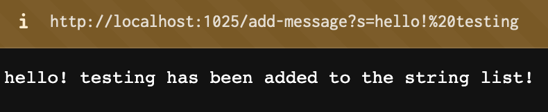
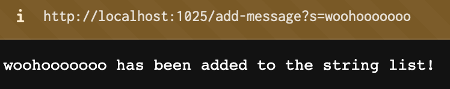
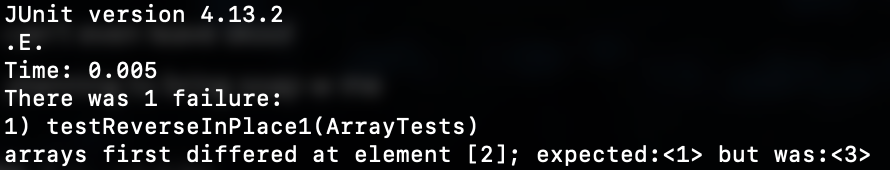

# Lab Report 2

## Part 1

StringServer.java

```java
import java.io.IOException;
import java.net.URI;
import java.util.ArrayList;

class Handler implements URLHandler {
    ArrayList<String> words = new ArrayList<String>();

    public String handleRequest(URI url) {
        if (url.getPath().equals("/")) {
            String listOfWords = "";
            for(int i = 0; i < words.size(); i++) {
                listOfWords += words.get(i) + "\n";
            }
            return listOfWords;
        } else if (url.getPath().contains("/add-message")) {
            String[] parameters = url.getQuery().split("=");
            if (parameters[0].equals("s")) {
                words.add(parameters[1]);
                return parameters[1] + " has been added to the string list!";
            }
            return "Usage: /add-message?s=<message here>";
        }
        else {
            return "404 not found!";
        }
    }
}

class StringServer {
    public static void main(String[] args) throws IOException {
        if(args.length == 0){
            System.out.println("Missing port number! Try any number between 1024 to 49151");
            return;
        }

        int port = Integer.parseInt(args[0]);

        Server.start(port, new Handler());
    }
}
```

Usage examples:



This request calls the `handleRequest` method. The URL is passed as argument to the `handleRequest` method, which detects the `add-message` field, causing the string "hello! testing" to be added to the internal word ArrayList `words`. 



This request is processed in the exact same way as the previous request, except the string this time is "woohooooooo". The `handleRequest` method is called, which detects the `add-message` field and adds "woohooooooo" to the internal `words` ArrayList.

## Part 2

Chosen bug: `reverseInPlace` method in `ArrayExamples.java`

Test with buggy input:

```java
@Test
public void testReverseInPlace1() {
  int[] input = {1, 2, 3};
  ArrayExamples.reverseInPlace(input);
  assertArrayEquals(new int[]{3, 2, 1}, input);
}
```

Test with non-buggy input:

```java
@Test
public void testReverseInPlace2() {
  int[] input = {3, 2, 3};
  ArrayExamples.reverseInPlace(input);
  assertArrayEquals(new int[]{3, 2, 3}, input);
}
```

jUnit output:



Before code:

```java
static void reverseInPlace(int[] arr) {
  for(int i = 0; i < arr.length; i += 1) {
    arr[i] = arr[arr.length - i - 1];
  }
}
```

After (fixed) code:

```java
static void reverseInPlace(int[] arr) {
  for(int i = 0; i < arr.length / 2; i += 1) {
    int firstNum = arr[i];
    int secondNum = arr[arr.length - i - 1];
    arr[i] = secondNum;
    arr[arr.length - i - 1] = firstNum;
  }
}
```

This fixes the issue with reverseInPlace by properly storing the elements that are about to be swapped before one overrides the other. The original implementation is buggy because it does not account for how the array changes as the for loop progresses.

## Part 3

Something I learned in Lab 2 was how Java can create and process simple web servers. I learned how Java can process URIs just like regular function inputs and strings. I was honestly surprised at how relatively simple the code was for the web servers; I thought everything would be made a lot more complicated since it's actually part of a real web server, but it's really the exact same coding that we've been learning all along, just with different input methods.
