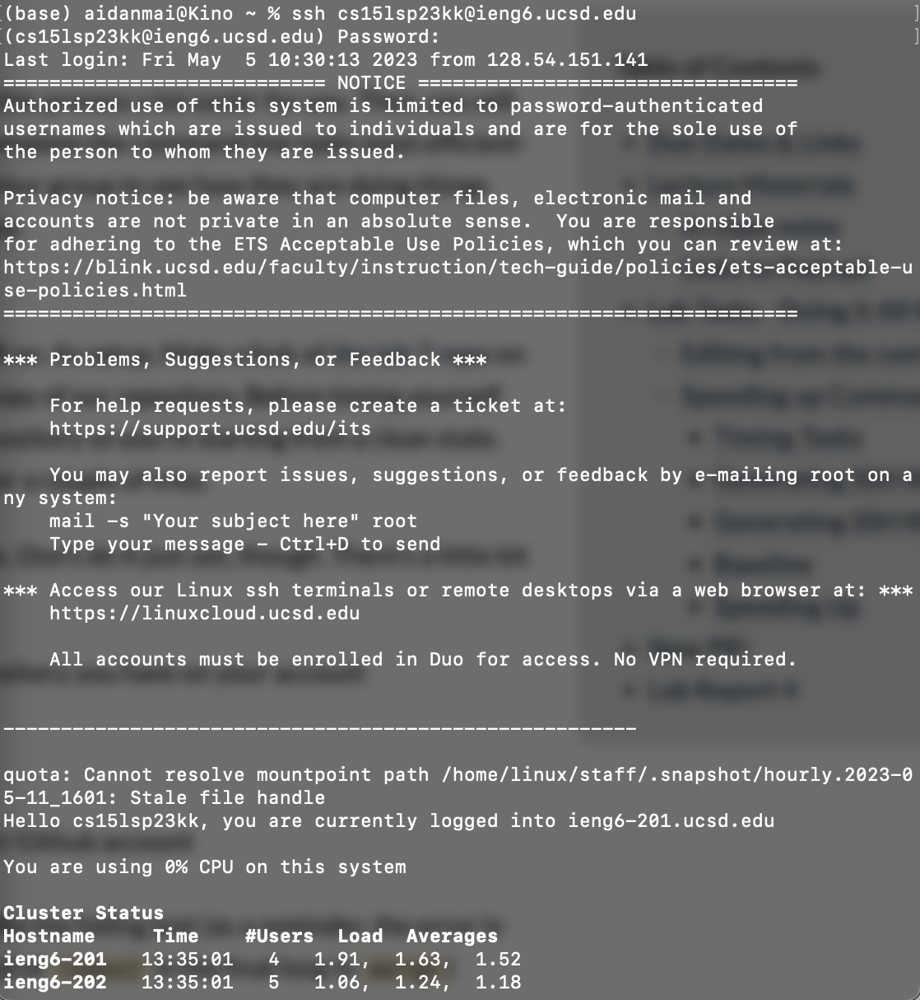
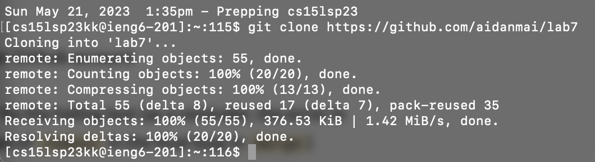
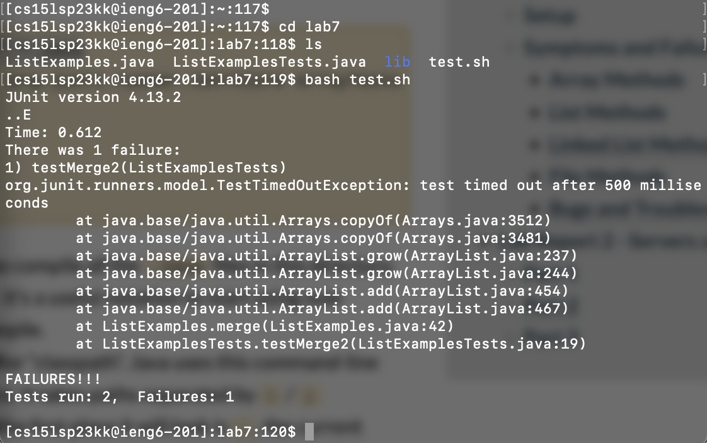
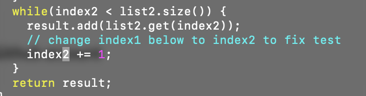
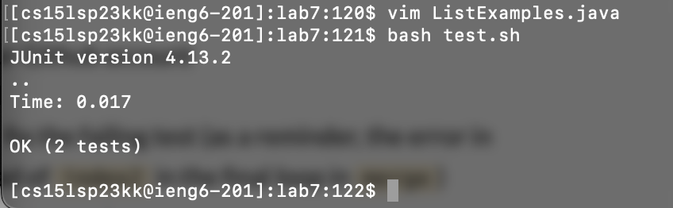
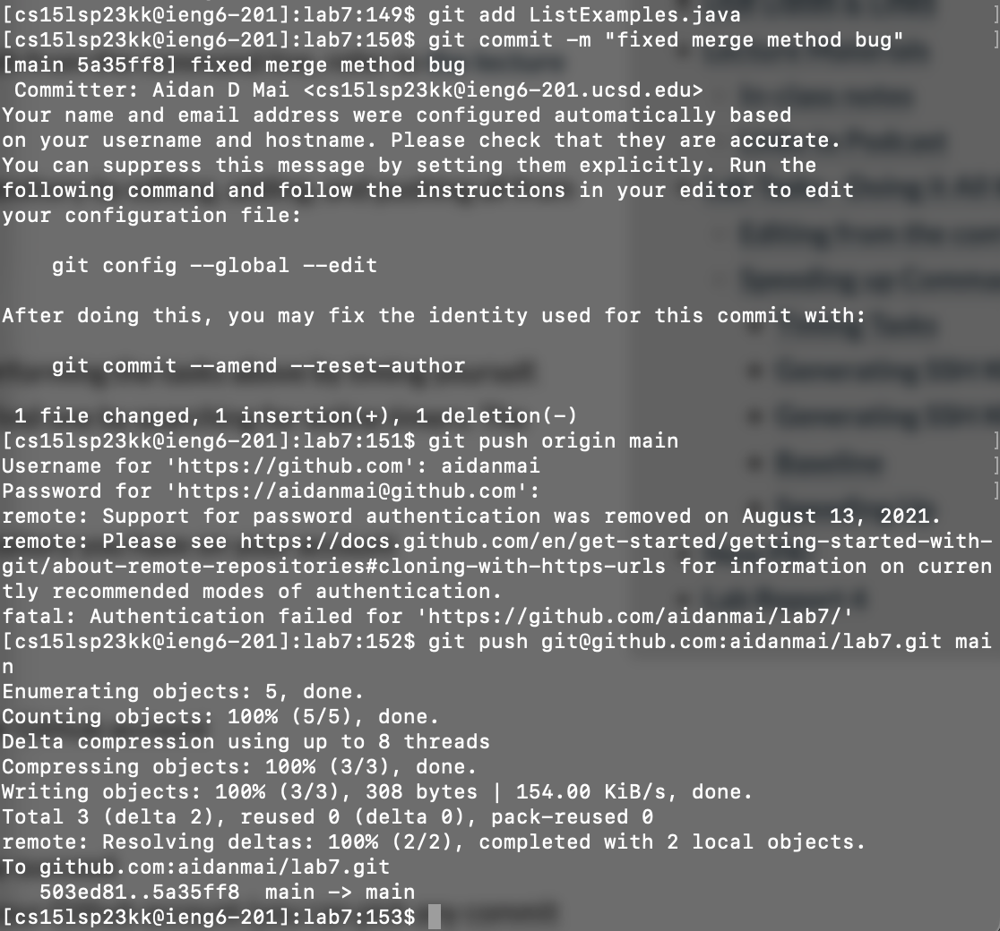

# Lab Report 4

## Step 4: Logging into ieng6

To log into ieng6, I created a new terminal window, typed the command `ssh cs15lsp23kk@ieng6.ucsd.edu`, and entered my password.

## Step 5: Cloning the repository

Once I was logged into ieng6, I cloned the lab7 repository using the command `git clone https://github.com/aidanmai/lab7`. This command pulls all the files from the github repository and places them into my working environment, in the `lab7` directory.

## Step 6: Running the tests

To run the tests, I first entered the repository directory using `cd lab7`. From there, I ran the command `bash test.sh`, which compiled all files and ran the jUnit tests in the `ListExamplesTest.java` file. The tests failed, meaning that there are bugs to fix in `ListExamples.java`.

## Step 7: Editing the code file

In order to edit the `ListExamples.java` to fix the bug, I opened the file with vim with the command `vim ListExamples.java`. From there, I scrolled down to the buggy line and clicked on the `1` to move my cursor to the correct spot. Next, I pressed the key `r` to enter replace mode, and then `2` to replace the 1 in `index1` with a 2. Now that the bug is fixed, I typed `:wq <enter>` to save the file and exit.

## Step 8: Running the tests again

Now that the bug is fixed, I ran the command `bash test.sh` to run the tests again. As expected, the tests passed, meaning the bug is fixed.

## Step 9: Pushing to GitHub

To push my changes back to the GitHub repository, I first ran `git add ListExamples.java` to add the `ListExamples.java` file to the staging area. Next, to add a commit message, I typed `git commit -m "fixed merge method bug"`. Finally, I typed `git push git@github.com:aidanmai/lab7.git main`, which uses the SSH key generated previously in the lab to push the `ListExamples.java` changes back to the GitHub repository.
